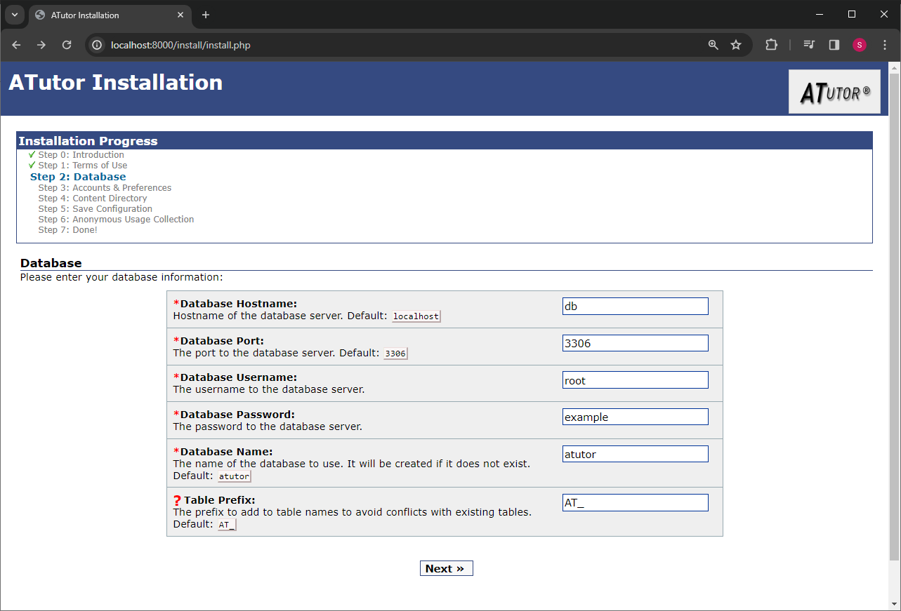
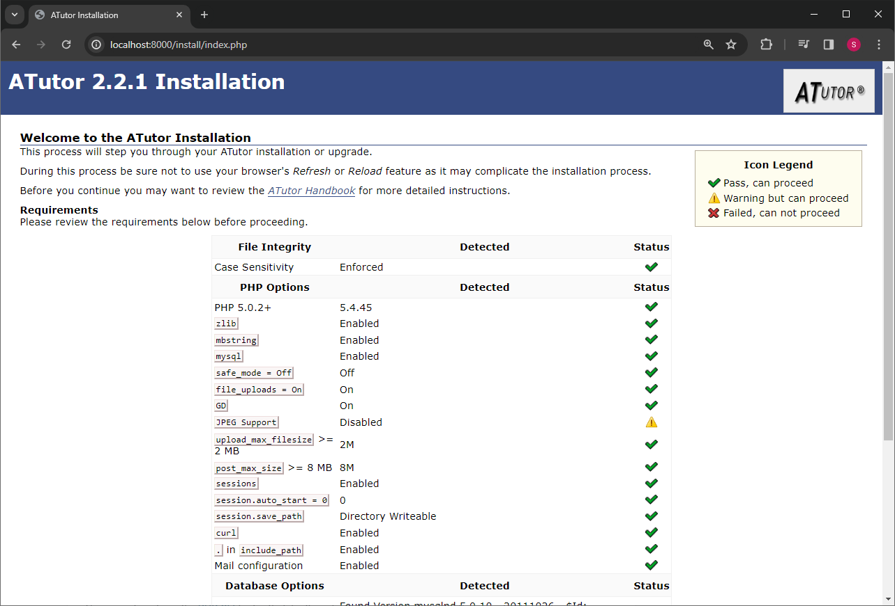

# ATutor2.2.1

## Setting up

The setup has been tested with Ubuntu22 on WSL2.

Ensure that you have Docker setup on the system.

DB has been setup to use `root:example`.

Remember to change the Database Hostname to `db` to correspond with the service name in the Docker Compose file.

## Usage

Visit `http://localhost:8000` to access the application.

## Notes

Included Adminer on `http://localhost:8080`.

Not able to figure out how to enable JPEG support, but installation is able to proceed so will not try fixing this.

It might be linked to how `libfreetype-dev` has not been installed (commented out in the `Dockerfile`).

## TODO

- check entire app works properly
- check if php display errors is working
- check if sql logging is setup correctly
